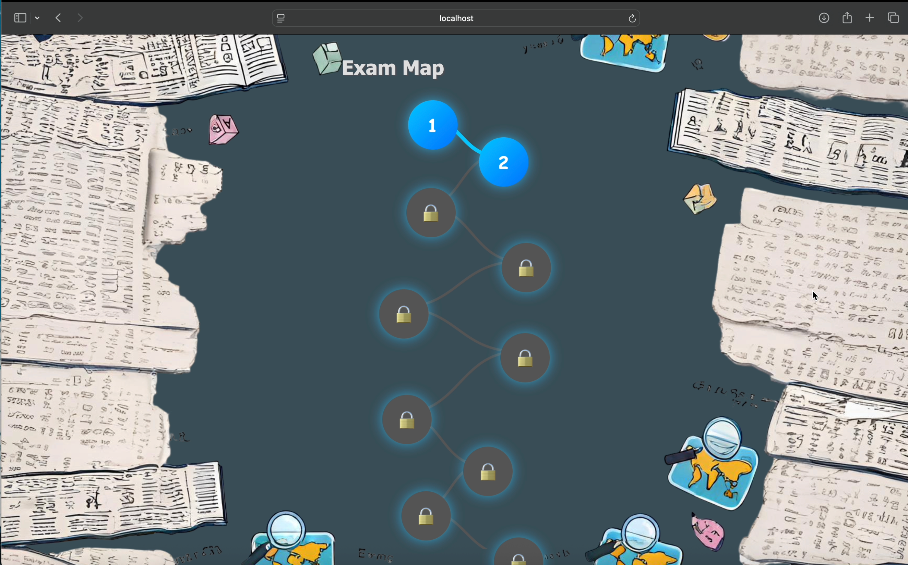
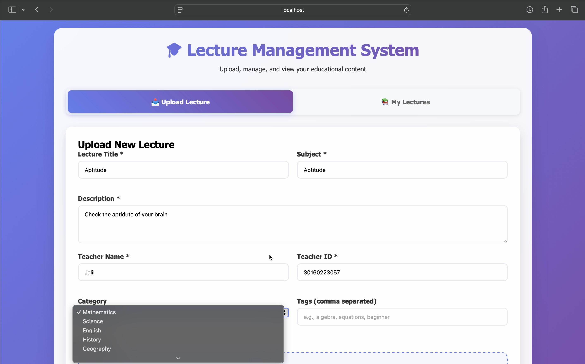
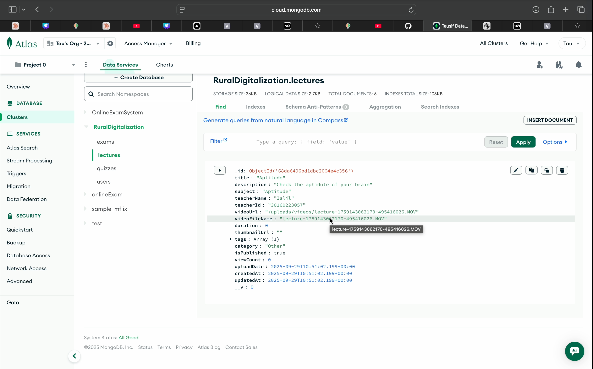

## 🌐 Nabha Digital Hub  
> Empowering rural education through accessible digital learning and smart school management.


## 📖 Overview  
**Nabha Digital Hub** is a web-based digital learning platform designed to modernize education in government and rural schools around Nabha.  
It bridges the digital divide by providing an integrated environment for **students, teachers, and administrators** to learn, track progress, and manage educational activities efficiently.

---

 ##🚀 Key Features  

 🧠 Learning & Content Access  
- Interactive modules and digital lessons accessible on low-bandwidth connections.  
- Audio-visual learning support for visual impered students and with voice command.  
- Offline caching of essential content for areas with weak internet connectivity.  

 🧑‍🏫 Teacher Dashboard  
- Upload, manage, and assign lessons or assessments.  
- Real-time student progress tracking and attendance monitoring.  

👩‍🎓 Student Dashboard  
- Gamified exam and digiatl learning Module with multi language supports.  
- Can access the uploaded videos in Downlaodable form.  
- Attendance Feature for easy attendance.  

 🏫 Admin Panel  
- School-wide performance analytics and reporting.  
- Role-based access control (Admin/Teacher/Student).  
- Cloud-based data management (Google Cloud + MongoDB).  

---
## 🖼️ Screenshots  

> *(Below are sample placeholders — replace these links with your actual screenshots later.)*

| Screenshot | Description |
|-------------|--------------|
|  | Student Dashboard Interface |
|  | Gemified Assignment Map |
|  | Admin video upload section |
|  | database for uploaded videos


---

## 💻 Tech Stack  

| Layer | Technologies Used |
|-------|--------------------|
| **Frontend** |  Html, Tailwind CSS, Javascript |
| **Backend** | Node.js, Express.js |
| **Database** | MongoDB |
| **AI / Assistive Features** | Web Speech API (Text-to-Speech, Voice Commands) |
| **Version Control** | Git, GitHub |

---

## 🚀 Future Enhancements  

- 📱 **Mobile App Version:** Flutter-based hybrid app for offline-first access.  
- 🤖 **AI Tutor Module:** Personalized adaptive learning and smart feedback.   
- ☁️ **School Network Integration:** Link multiple schools under a shared digital ecosystem.  

---
## 👨‍💻 Authors and Contributors
- **Team: Clever Codex**,
- Tausif Khan(Team Leader , Backend Developer)

🔄 Workflow  

```mermaid
flowchart TD
A[User Login / Signup] --> B[Role-Based Dashboard]
B --> C[Teacher: Create & Assign Lessons]
B --> D[Student: Access Lessons & Attempt Quizzes]
B --> E[Admin: Monitor Reports & Analytics]
C --> F[MongoDB + Cloud Storage]
D --> F
E --> F
F --> G[Real-Time Updates & Insights]
# Nabha
